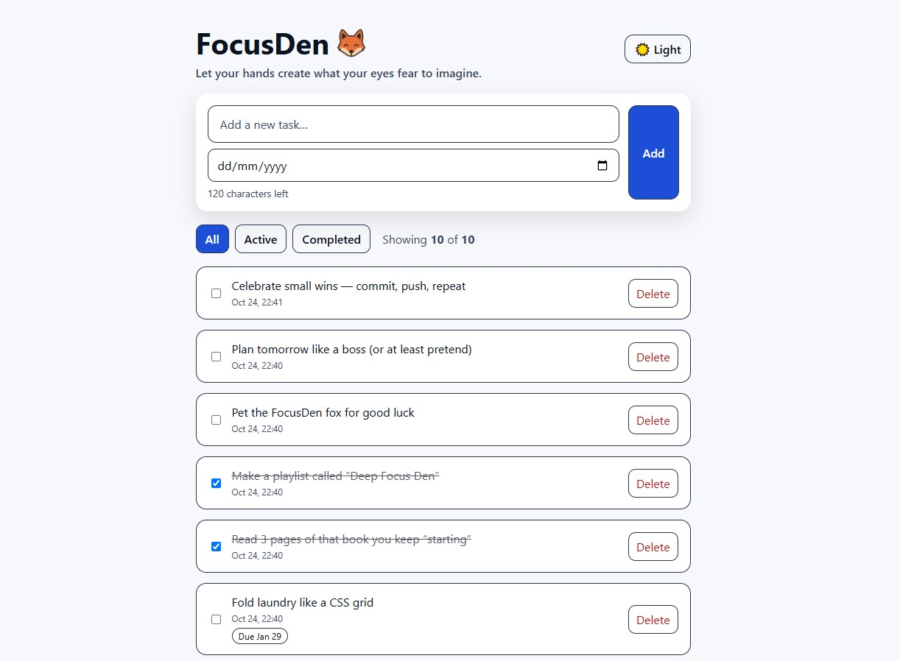

# 🦊 FocusDen

> _Let your hands create what your eyes fear to imagine._

A calm, minimalist productivity app built with **React**, **Zustand**, and **styled-components**.  
FocusDen helps you stay organized and present — without noise or clutter.

🌐 **Live demo:** [https://focusden.netlify.app](https://focusden.netlify.app)

---

## 🖼️ Preview

---

## ✨ Features

- ✅ Add, complete, and delete tasks  
- ✅ Filter by **All / Active / Completed**  
- ✅ Optional **due date** and automatic “Overdue” indicator  
- ✅ Character counter on new tasks  
- ✅ Persistent data with `localStorage`  
- ✅ Light & dark mode toggle  
- ✅ Clean, responsive layout (320px–1600px)  
- ✅ 95+ Lighthouse accessibility score  
- 🦊 Minimalist, focus-friendly design  

---

## 🧠 Tech Stack

| Technology | Purpose |
|-------------|----------|
| ⚛️ React (Vite) | Core UI framework |
| 🪣 Zustand | Global state management (no prop drilling) |
| 💅 styled-components | Component-scoped styling |
| 🕒 date-fns | Date formatting & overdue logic |
| 🌗 localStorage | Persistent task storage |
| 🧪 ESLint + Vite | Clean, fast developer setup |

---

## 🗂️ Folder Structure

    src/
     ├─ assets/
     │   ├─ favicon.jpg
     │   └─ focusden-preview.png
     ├─ components/
     │   ├─ TodoForm.jsx
     │   ├─ TodoList.jsx
     │   ├─ TodoItem.jsx
     │   ├─ EmptyState.jsx
     │   └─ Footer.jsx
     ├─ store/
     │   ├─ useTodoStore.js
     │   └─ useThemeStore.js
     ├─ styles/
     │   ├─ GlobalStyles.js
     │   └─ media.js
     ├─ App.jsx
     └─ main.jsx

---

## 🪄 Getting Started

1️⃣ Install dependencies  
→ Run: `npm install`  

2️⃣ Start the app locally  
→ Run: `npm run dev`  

3️⃣ Build for production  
→ Run: `npm run build`  

Then open the generated `/dist` folder in your browser.

---

## 🚀 Stretch Goals

🕓 Filter tasks by **due date** or **overdue**  
🏷️ Add **tags / categories**  
🔔 Add **reminders or notifications**  
☁️ Sync tasks with a backend or cloud API  

---

## 📱 Responsiveness

| Device | Example width | Behavior |
|---------|----------------|-----------|
| 📱 Mobile | up to 480px | Stacked layout, larger tap areas |
| 💻 Tablet | ≥ 768px | Balanced grid, adaptive text |
| 🖥️ Desktop | ≥ 1024px | Fixed-width centered container |
| 🖥️ XL screens | ≥ 1440px | Fluid, maximum readability |

---

## ♿ Accessibility

✔ Visible focus states and proper labels  
✔ `aria-live` announcements for task counts  
✔ Sufficient color contrast (WCAG AA)  
✔ Keyboard-friendly navigation  
✔ Semantic HTML structure  

---

## 👩‍💻 Author

Made with 🍵, 🎧, curiosity, and a generous dose of AI magic by Ulrika Einebrant.
Frontend developer passionate about clean design, accessibility, and calm user experiences.
“Let your hands create what your eyes fear to imagine.”

---

## 🪶 License

This project is open source and available under the **MIT License**.

---

## 💫 Connect

🔗 **Live app:** [focusden.netlify.app](https://focusden.netlify.app)  
💻 **GitHub repo:** [github.com/yourusername/focusden](https://github.com/yourusername/focusden)  
🧭 **Portfolio:** [ulrikasportfolio.netlify.app](https://ulrikasportfolio.netlify.app/)  
💼 **LinkedIn:** [ulrika-einebrant](https://www.linkedin.com/in/ulrika-einebrant/)
